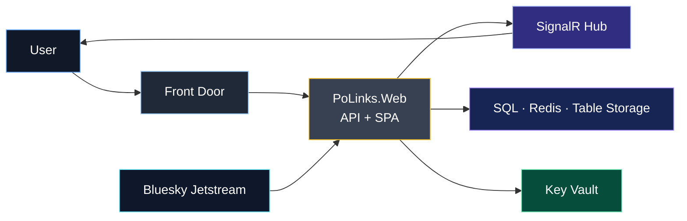
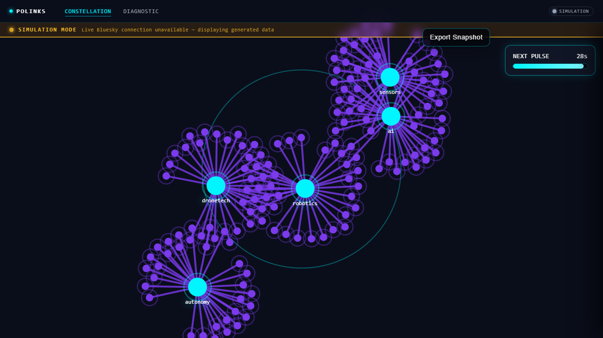
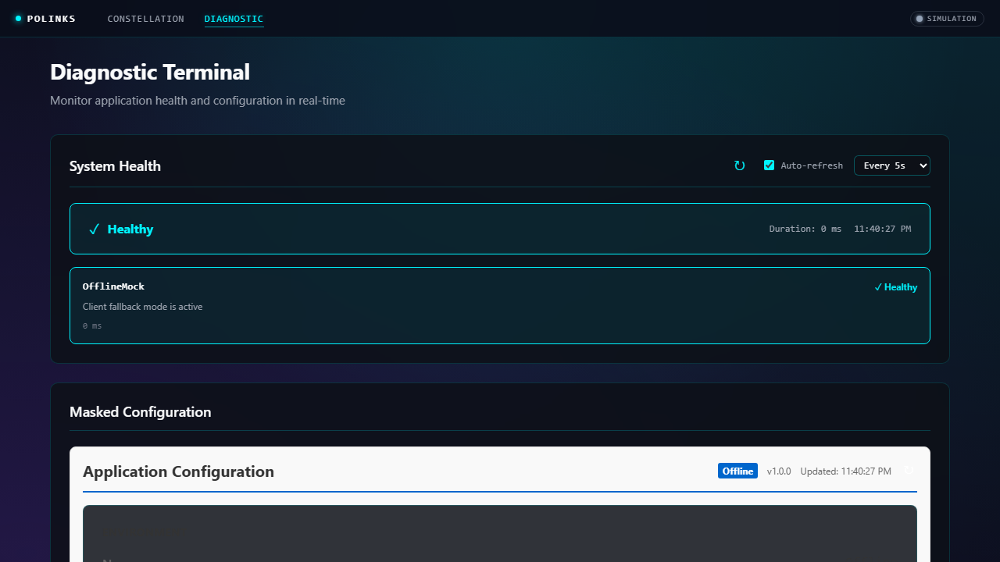

# PoLinks

Real-time semantic observability platform for robotics discourse. Ingests a Bluesky Jetstream WebSocket firehose, scores hype and sentiment, and delivers a pulse-driven constellation graph with integrated diagnostics and snapshot export. Built as a unified .NET 10 + React SPA hosted on Azure App Service.

## Architecture Overview



**Key design decisions:**
- **Vertical Slice Architecture (VSA)** — features own their DTOs, logic, and endpoints.
- **Unified host** — React SPA served from `wwwroot`; only one process to start.
- **10-second pulse rhythm** — `PulseService` assembles + broadcasts via `SignalR PulseHub`.
- **Offline-capable client** — React app falls back to `offlineApi.ts` when no backend is reachable.
- **Observability-first** — structured logs, correlation IDs, `/diagnostic/*` endpoints, OpenTelemetry.

## Documentation Map

| File | Description |
|---|---|
| [docs/Architecture_MASTER.mmd](docs/Architecture_MASTER.mmd) | C4 L1+L2 combined — system context and container detail |
| [docs/Architecture.mmd](docs/Architecture.mmd) | System context with Edge / App / Data tier subgraphs |
| [docs/Architecture_SIMPLE.mmd](docs/Architecture_SIMPLE.mmd) | High-level architecture (7 nodes) |
| [docs/DataLifecycle_MASTER.mmd](docs/DataLifecycle_MASTER.mmd) | Full data path: Ingestion → Processing → Egress + UI |
| [docs/SystemFlow.mmd](docs/SystemFlow.mmd) | User journey combined with realtime data pipeline |
| [docs/SystemFlow_SIMPLE.mmd](docs/SystemFlow_SIMPLE.mmd) | Simplified system flow (6 nodes) |
| [docs/DataModel.mmd](docs/DataModel.mmd) | ERD with status enums and state transitions |
| [docs/DataModel_SIMPLE.mmd](docs/DataModel_SIMPLE.mmd) | ERD relationships only |
| [docs/UserJourney.mmd](docs/UserJourney.mmd) | Full user journey: land → explore → focus → export → diagnose |
| [docs/UserJourney_SIMPLE.mmd](docs/UserJourney_SIMPLE.mmd) | Simplified user journey (7 nodes) |

## Blast Radius Assessment

| Proposed Refactor | Downstream Dependencies | Risk | Mitigation |
|---|---|---|---|
| Rebuild docs into 10 canonical diagrams | Engineering onboarding, AI context ingestion, architecture reviews | Low | Explicit README links; no runtime changes |
| Unified pipeline vocabulary in diagrams | API, SignalR, ingestion, diagnostics teams | Medium | Names match code contracts exactly |
| Removed legacy redundant `.mmd` files | Existing deep-links in tooling or CI | Low | All content merged into canonical files |

## Local Run

**Option A — Standalone (no backend required):**
```bash
cd src/PoLinks.Web/ClientApp
npm run dev:standalone
```

**Option B — Hosted (full stack):**
```bash
docker compose up -d
dotnet build src/PoLinks.Web/PoLinks.Web.csproj
dotnet run --project src/PoLinks.Web/PoLinks.Web.csproj --launch-profile http
```

## Runtime Endpoints

| Endpoint | Purpose |
|---|---|
| `/` | React SPA |
| `/hubs/pulse` | SignalR pulse hub |
| `/health` | ASP.NET health checks |
| `/diagnostic/health` | Deep health check detail |
| `/diagnostic/config` | Masked config inspection |
| `/diagnostic/logs` | Live structured log stream |
| `/diagnostic/uptime` | Uptime analytics |
| `/api/snapshot/export-metadata` | Snapshot export metadata |

## Screenshots

| Dashboard | Diagnostic |
|---|---|
|  |  |

## Prerequisites

- .NET SDK 10
- Node.js 20+
- Docker Desktop (for Azurite emulation)
