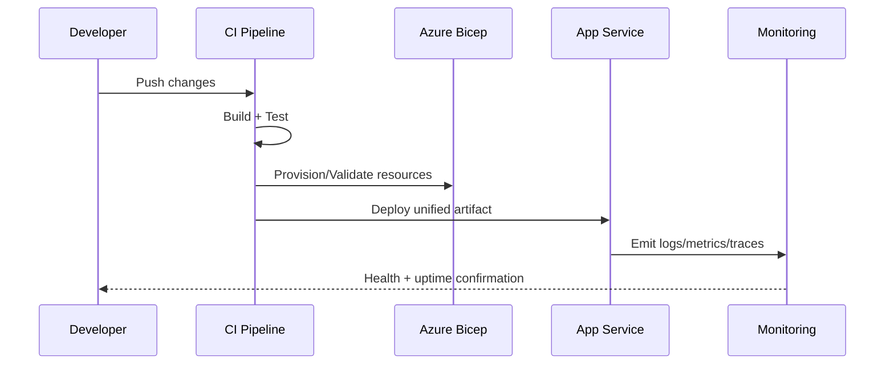

# PoLinks DevOps Guide

## Deployment Topology
- Edge: Azure Front Door.
- App: Azure App Service hosting unified .NET + React artifact.
- Data: Azure SQL, Azure Cache for Redis, Azure Table Storage.
- Secrets: Shared Azure Key Vault via managed identity and RBAC.

## CI/CD Logic
1. Build and validate backend.
2. Build frontend bundle.
3. Execute unit, integration, and E2E suites.
4. Package as unified web artifact.
5. Deploy infra with Bicep.
6. Deploy app to App Service.
7. Run post-deploy health probes and pulse sanity checks.

## Environment Secret Strategy
- Source secrets from Key Vault first.
- Do not persist secrets in appsettings files.
- Use system-assigned managed identity for data-plane access.
- Rotate secrets and validate with diagnostic config endpoint masking checks.

## Day 1 Local Onboarding
### Prerequisites
- .NET SDK 10
- Node.js 20+
- Docker Desktop

### Quick Start
1. Start local Azure emulation:
   - docker compose up -d
2. Build backend:
   - dotnet build src/PoLinks.Web/PoLinks.Web.csproj
3. Run frontend standalone (no backend dependency):
   - cd src/PoLinks.Web/ClientApp
   - npm run dev:standalone
4. Optional hosted mode:
   - dotnet run --project src/PoLinks.Web/PoLinks.Web.csproj

## Runtime Endpoints
- Health: /health and /diagnostic/health
- Config inspection: /diagnostic/config
- Uptime analytics: /diagnostic/uptime
- Log stream: /diagnostic/logs
- Snapshot metadata: /api/snapshot/export-metadata
- Pulse hub: /hubs/pulse

## Observability Controls
- Structured logs with correlation IDs.
- Serilog console/file/Application Insights sinks.
- OpenTelemetry traces and metrics with optional OTLP exporter.
- Diagnostic dashboard route for operator-friendly health visibility.

## Blast Radius Assessment
| Proposed Refactor | Downstream Service Dependencies | Expected Impact | Risk Level | Mitigation |
|---|---|---|---|---|
| Replace fragmented runbooks with single DevOps.md | On-call engineers, CI maintainers, onboarding automation | Faster troubleshooting and fewer setup mismatches | Medium | Keep endpoint and command names identical to implemented services |
| Standardize endpoint inventory and health workflow | Diagnostic page, health checks, monitoring probes | Better operator consistency across environments | Low | Validate URLs against existing endpoint mappings |
| Consolidate deployment narrative around unified host model | App Service release process, frontend/backend ownership | Reduces release handoff confusion | Medium | Explicitly document standalone and hosted modes |
| Enforce one source for secrets policy documentation | Security reviews, infra pipelines, contributor setup | Improves audit clarity and prevents config drift | Medium | Tie policy statements to existing infra/README constraints |

## Deployment Sequence

