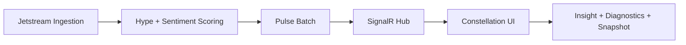

# PoLinks Product Spec

## Product Purpose
PoLinks is a real-time semantic observability platform for robotics discourse. It turns high-velocity social signal streams into a living constellation where teams can detect trend emergence, investigate why a node is heating up, and preserve exportable visual evidence.

## Problem Statement
Engineering and product teams lose time interpreting fragmented social and ecosystem signals across channels. Static dashboards hide temporal motion and relationship strength. PoLinks solves this by combining pulse-driven graph rendering with context-rich diagnostics.

## Target Outcomes
- Reduce time-to-insight for emerging topics from hours to minutes.
- Improve confidence in platform trust through always-visible diagnostics and correlation IDs.
- Preserve analytical snapshots for asynchronous sharing and incident review.

## Core Personas
- Research Analyst: Tracks ecosystem drift and cluster formation.
- Platform Engineer: Validates ingestion and runtime health quickly.
- Product Strategist: Uses trend evidence for roadmap and partner decisions.

## Feature Definitions
1. Live Semantic Constellation
- 10-second pulse rhythm with node growth/decay and relationship updates.
- Focus mode for anchor-isolated exploration.
- Ghost overlays for short-term historical contrast.

2. Insight Surface
- Click-driven semantic roots and impact-sorted posts.
- Sentiment-coded post stream for rapid narrative interpretation.

3. Operational Trust Plane
- Deep health checks and masked configuration visibility.
- Live diagnostic logs with correlation IDs.

4. Snapshot Export
- Deterministic export metadata and high-resolution client capture flow.

## Business Logic Summary
- Signal ingestion enters through Jetstream and profile enrichment.
- Scoring computes hype and sentiment, producing a pulse batch.
- Pulse batch fans out to clients through SignalR and updates visualization state.
- Diagnostic endpoints expose health/config/log analytics without requiring local debug access.

## Success Metrics
| Metric | Target | Measurement Method |
|---|---:|---|
| Cold start to visible anchors | <= 3 seconds | Browser telemetry and E2E traces |
| Pulse cadence stability | 10 seconds +/- 1 second | Server pulse logs and client heartbeat checks |
| Insight retrieval interaction | <= 5 seconds | UX timing between node click and post feed paint |
| Diagnostic readiness | <= 5 seconds | /diagnostic health/config/log endpoint timing |
| Snapshot readiness | <= 3 seconds metadata + capture | API timing + client capture duration |
| Soft uptime | >= 99.5% | Diagnostic uptime probes |

## Blast Radius Assessment
| Proposed Refactor | Downstream Service Dependencies | Expected Impact | Risk Level | Mitigation |
|---|---|---|---|---|
| Consolidate architecture docs into 3 canonical diagrams + SIMPLE variants | Engineering onboarding, architecture review rituals, AI-assisted context ingestion | Faster understanding, fewer conflicting references | Low | Preserve explicit links in README and keep legacy specs untouched |
| Normalize flow language to one end-to-end pipeline vocabulary | API, SignalR, ingestion, diagnostics teams | Reduces cross-team terminology drift | Medium | Keep endpoint names and object names identical to code contracts |
| Merge product intent and metric logic into one high-signal PRD | Product planning, QA acceptance criteria, observability dashboards | Better traceability from feature to KPI | Medium | Keep measurable thresholds aligned with existing spec success criteria |
| Centralize deployment/onboarding guidance into DevOps.md | DevOps runbooks, CI/CD operators, new contributors | Removes setup ambiguity and duplicate run instructions | Medium | Include direct commands and fallback notes for standalone mode |

## Scope Notes
- This documentation refactor does not alter runtime behavior or deployment topology.
- Existing implementation specs under specs/ remain authoritative for detailed engineering task breakdowns.

## Visual References
- Dashboard capture: [screenshots/dashboard.png](screenshots/dashboard.png)
- Diagnostic capture: [screenshots/diagnostic.png](screenshots/diagnostic.png)

## System Snapshot (Condensed)

